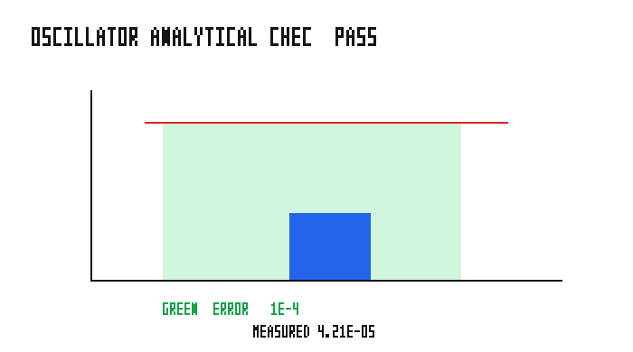
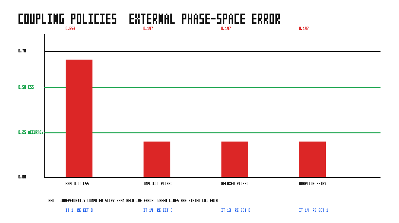
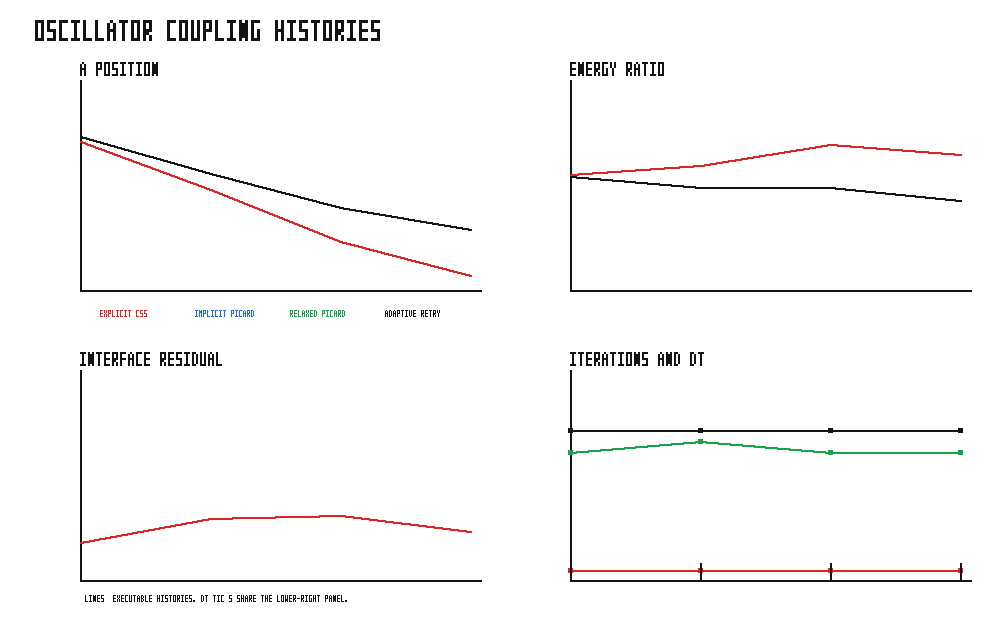
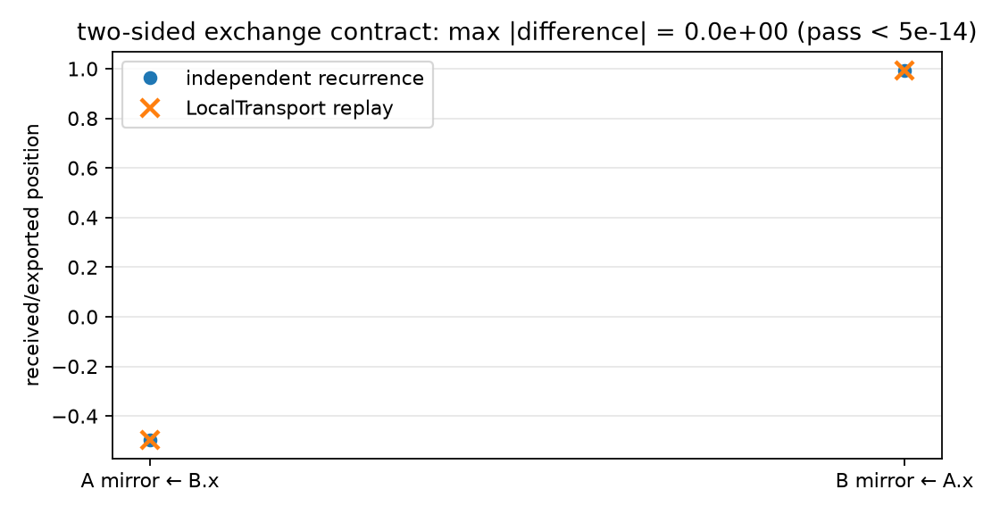

# Coupled Oscillators: One Model, Several Ways to Run It

This is a runnable tour of a deliberately small scientific problem: two masses
joined by a stiff interface spring. It is not a recipe for a particular kind of
discretisation. The two oscillator instances could stand in for two mesh,
particle, or other solvers.

The central idea is simple: **keep the scientific component and its exchange
contract unchanged; change only the parent orchestration and, later, the
transport.** That lets an application author start with an in-process experiment
and carry the same seam to an MPI job without moving coupling policy into either
solver library.

The complete sources are kept with the runnable examples:

- [one oscillator library and the local composition](../../../examples/oscillator_demo/);
- [explicit, Picard, relaxed, and adaptive schedules](../../../examples/oscillator_coupling_schemes/);
- [LocalTransport replay and the two MPI binaries](../../../examples/oscillator_mpmd/).
- [one binary with TOML-selected local or MPI placement](../../../examples/oscillator_spmd/).

All commands below are run from the Grass repository root.

```bash
source ~/projects/.build-env
```

## 1. Start with a standalone scientific component

`oscillator_demo` owns one oscillator's physical state, its semi-implicit Euler
step, parameters, and plugin configuration. It does not know whether a peer
exists. In particular, it does not contain a parent loop, MPI calls, or a
neighbour's state type. The library exposes `OscillatorState` for its own use,
`PeerPosition` as its local input, and `PositionPort<Source>` as the narrow
typed position payload used at a coupling boundary.

Run the library's local composition and its independent single-oscillator
check:

```bash
cargo run --example oscillator_demo
$BENCH_PYTHON examples/oscillator_demo/sweep.py
```

Expected tail of the first command:

```text
direct  fingerprint=[...]
port    fingerprint=[...]
PASS direct and port explicit composition agree
```

The sweep checks the uncoupled numerical oscillator against
`x=cos(t), v=-sin(t)` at `t=1`; the documented component-error limit is
`1e-4`. It also checks that the generated two-subapp configuration parses and
runs.



The two oscillator inputs are ordinary declarative TOML, not a setup script:

```toml
[a.oscillator]
x0 = 1.0
coupling_stiffness = 2000.0
dt = 0.01
```

Ask the executable for a complete starter reference instead of guessing keys:

```bash
cargo run --example oscillator_demo -- --generate-config
```

It prints the namespaced `[A.oscillator]` and `[B.oscillator]` tables together
with generated field metadata. The [generated configuration reference](../model/io.md#generated-configuration-reference)
explains what those comments mean and why scenario intent still belongs in the
example's declarative `config.toml`.

## 2. Compose two local sub-Apps

An **App** here is simply the container in which a solver keeps named typed
state and registered operations. A **sub-App** is one such solver owned by a
parent application. The parent owns the order in which both solvers advance;
neither oscillator needs to learn about the other.

The local parent builds two unchanged library instances and gives their steps
explicit names:

```rust,ignore
parent.add_subapp_with_config(A::NAME, |app| app.add_plugins(OscillatorPlugin));
parent.add_subapp_with_config(B::NAME, |app| app.add_plugins(OscillatorPlugin));

parent.add_update_system(tick_subapp(A::NAME, 1), Phase::TickA);
parent.add_update_system(/* exchange */,              Phase::Couple);
parent.add_update_system(tick_subapp(B::NAME, 1), Phase::TickB);
```

The phase order is the numerical method. This example intentionally uses an
explicit one-step-lag exchange: A advances, the interface is exchanged, then B
advances. A different ordering is not a harmless implementation detail—it is a
different coupling scheme.

### Direct exchange is useful for an experiment

For a tightly bound, throwaway experiment, the parent can directly read both
private resources with typed namespace handles:

```rust,ignore
fn direct_exchange(
    a: MultiRes<OscillatorState, A>, b: MultiRes<OscillatorState, B>,
    mut a_peer: MultiResMut<PeerPosition, A>,
    mut b_peer: MultiResMut<PeerPosition, B>,
) {
    a_peer.0 = b.x;
    b_peer.0 = a.x;
}
```

This is selected from the [runnable local parent](../../../examples/oscillator_demo/main.rs).
It is concise, and it is intentionally source-coupled: the application names
`OscillatorState` on both sides. Keep this form for a short experiment whose
participants change together. Do not tick a sub-App and take `MultiRes` access
in the same system; the tick needs exclusive access to the sub-App collection,
whereas `MultiRes` holds a shared borrow. Separate phases avoid that runtime
borrow failure.

### Promote the stable seam to a typed port

When the exchange boundary should survive independent solver changes, the
parent declares two directional position contracts. Each solver publishes a
value derived from its own state and consumes into its own input:

```rust,ignore
parent.add_port::<PositionPort<A>>();
parent.add_port::<PositionPort<B>>();
parent.add_update_system(
    expose_field::<OscillatorState, PositionPort<A>>(A::NAME, PositionPort::<A>::from_state),
    Phase::Couple,
);
parent.add_update_system(
    consume_field::<PeerPosition, PositionPort<A>>(B::NAME, |peer, value| {
        peer.0 = value.position.0
    }),
    Phase::Couple,
);
```

The symmetric B-to-A registration is in the [full source](../../../examples/oscillator_demo/main.rs).
Only `PositionPort<A>` is shared at this boundary; B does not need to name A's
private state. The direct and port forms deliberately produce the same explicit
result above, so the port is a change of coupling contract, not a changed
physical model.

## 3. Change the orchestration, not the solvers

The interface is deliberately stiff (`k_c=2000`). With the coarse macro step,
the difference between coupling schedules becomes visible. Run every local
schedule and regenerate its evidence:

```bash
$BENCH_PYTHON examples/oscillator_coupling_schemes/showcase.py
```

The executable reports four policies, followed by `ALL CHECKS PASSED`:

```text
explicit CSS       ... relative_error=0.653...
implicit Picard    ... relative_error=0.197...
relaxed Picard     ... iterations=13 ... relative_error=0.197...
adaptive retry     ... rejected=1 accepted_dt=0.01000 ...
ALL CHECKS PASSED
```

The exact last digits are implementation output; the important checks are that
the deliberately lagged explicit CSS error is above `0.50`, while the three
rollback Picard policies are below the stated `0.25` phase-space accuracy
budget. The reference is independently reconstructed with a matrix exponential;
the derivation and limitations are in [data/reference.md](../../../examples/oscillator_coupling_schemes/data/reference.md).



### What the policies mean

| Policy | Parent action | What to look for |
| --- | --- | --- |
| Explicit CSS | Advance one side with the other side's old interface value. | Interface lag is exposed in this strong-coupling case. |
| Implicit Picard | Save both states, repeatedly recompute a trial interface from that same saved state, and accept only a converged trial. | The interface residual falls below `picard_tolerance`. |
| Relaxed Picard | Blend the next interface guess with the old one using `relaxation = 0.7`. | The alternating fixed-point mode is damped; this run needs fewer iterations. |
| Adaptive retry | On a non-converged trial, restore both saved states, halve `dt`, and try again. | The initial `0.02` attempt is rejected and the `0.01` retry is accepted. |

The key rollback idea in the runnable schedule is short enough to inspect:

```rust,ignore
let start = pair(subs);
match solve_picard(subs, start, c, true) {
    Ok((accepted, iterations, residual)) => restore(subs, accepted),
    Err(residual) => { restore(subs, start); h *= 0.5; }
}
```

`solve_picard` starts every provisional sweep from `start`; it does not let
partially converged solver states accumulate. The full [schedule source](../../../examples/oscillator_coupling_schemes/main.rs)
shows the explicit exchange, saved state, residual, fixed relaxation, and retry
loop side by side. Its [configuration](../../../examples/oscillator_coupling_schemes/config.toml)
contains every physical and numerical input declaratively.



### Failure modes worth recognizing

- **Picard reaches its iteration cap.** This is not an accepted coarse step.
  The adaptive policy restores both oscillators and retries at a smaller step.
  If halving would pass `minimum_dt`, the example stops with an explicit
  "adaptive retry exhausted" diagnostic.
- **A port has not been published yet.** `consume_field` is intentionally a
  no-op until the first publication. Do not manufacture a default interface
  value merely to hide an ordering mistake; make the intended first exchange
  explicit.
- **A direct coupler and a tick live in one system.** The incompatible shared
  and exclusive sub-App borrows panic at runtime. Put them in separate phases.
- **A numerical result is called “implicit” merely because a loop exists.** A
  real Picard attempt restores the same macro-step start before every sweep and
  tests a residual before acceptance.

## 4. Keep the contract; replace memory with a transport

The next example changes no oscillator library code. Each binary owns its own
`OscillatorState`, integrator, and configuration. The parent replaces the
in-process peer with a remote mirror containing only this typed exchange
payload:

```rust,ignore
pub struct RemotePosition(pub f64);

impl Wire for RemotePosition {
    fn pack(&self) -> Vec<u8> { self.0.to_le_bytes().to_vec() }
    // try_unpack checks that exactly one f64 (8 bytes) arrived.
}
```

That is a deliberately narrow wire contract, not a serialization of the
solver's private state. The [complete `Wire` implementation](../../../examples/oscillator_mpmd/contract.rs)
also rejects malformed payload lengths with a typed error.

Before using MPI, run the exact two-sided contract in one process with paired
in-memory channels:

```bash
cargo test --example oscillator_mpmd_local
cargo run --example oscillator_mpmd_local
$BENCH_PYTHON examples/oscillator_mpmd/sweep.py
```

Expected final line:

```text
PASS LocalTransport replay matches the two-sided exchange contract
```

`LocalTransport::pair()` exercises the same pack, send, receive, and import
ordering without a cluster. Its full 40-step trajectory is independently
compared with the explicit recurrence at `5e-14`.



The remote parent's four phases make the causal order visible:

```text
TickLocal → Export(local position → remote mirror) → TickRemote → Import(remote mirror → local peer input)
```

Exporting before the remote tick is essential. The transport sends the mirror's
resource cell; omitting the export sends yesterday's position, creating an
unintended extra feedback delay.

## 5. Run the same seam as two MPI binaries

On a machine with a working MPI runtime, build and launch the two sides:

```bash
cargo build --features mpi --example oscillator_mpmd_a --example oscillator_mpmd_b
./examples/oscillator_mpmd/run_mpmd.sh
```

The launcher uses the MPMD arrangement:

```text
mpirun -np 1 oscillator_mpmd_a : -np 1 oscillator_mpmd_b
```

`a` must be MPI world rank 0 and `b` rank 1. Both use the same declarative
[`config.toml`](../../../examples/oscillator_mpmd/config.toml), including the
fixed 40-step termination contract. They exchange an initial position during
setup, then execute the four phases above on every step. The launch script
records both complete state traces and compares MPI, LocalTransport, and the
independently implemented recurrence; each maximum difference must be at most
`5e-14`.

Expected conclusion:

```text
PASS MPMD and LocalTransport full trajectories agree with the independent recurrence
```

If launch fails before a complete trace, first check the MPI runtime and the
rank order in the command. If a trace is incomplete, the launcher reports
missing, duplicate, or out-of-order steps. If the numerical comparison fails,
inspect the setup handshake and the export-before-remote-tick phase before
changing the oscillator library. A final bit fingerprint may differ across
heterogeneous floating-point paths; it is a warning only when all numerical
trajectory values still meet the `5e-14` criterion.

## The reusable takeaway

The oscillator is intentionally small, but the boundary is not special to
oscillators:

1. A scientific library owns its own state and step.
2. The coupling application owns the schedule, acceptance rule, and stable
   typed exchange payload.
3. A local parent can use direct state access for a short experiment, then use
   a port when the seam becomes a contract.
4. `LocalTransport` and MPI carry the same narrow contract; only the
   orchestration/transport boundary changes.

For the API-level rules behind this walkthrough, see [Coupling Two Solvers](./coupling-two-solvers.md)
and the [Scientific Library Composition Contract](../reference/library-composition-contract.md).
To make GRASS own the process bootstrap as well, continue with
[One Binary: Local or MPI from TOML](./single-binary-coupling.md).
