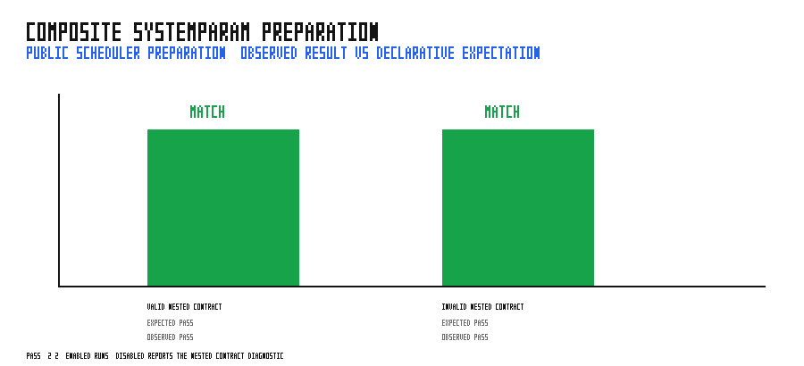

# composite_system_param_validation

This runnable case exercises the public scheduler preparation path for a
simulation-agnostic composite `SystemParam`. `CheckedContract` retrieves a
normal resource and validates a nested `enabled` field during
`Scheduler::organize_systems()`.

The matrix covers an enabled contract that prepares and runs, plus a disabled
contract that must be rejected during preparation. The rejection check requires
both the scheduler's validation heading and the composite parameter's precise
`contract.enabled must be true` diagnostic.

## Run

```bash
cargo run --example composite_system_param_validation
python3 examples/composite_system_param_validation/sweep.py
```

## Validation



The generated figure compares each observed outcome with its declarative
expectation. The committed result is PASS: 2/2 checks match; an enabled nested
contract runs, while a disabled one fails before the run loop with the expected
actionable diagnostic.
