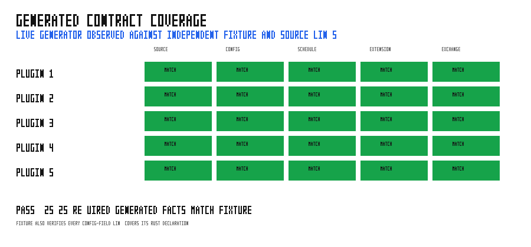

# contract_reference

`contract_reference` renders the generated mdBook page from live Grass plugin
contracts and typed configuration metadata. The probe registers the built-in
I/O plugins plus `oscillator_demo`, so a downstream library follows the same
path: declare metadata on `Plugin`, then add the plugin to the documentation
probe.

## Run

```bash
cargo run --example contract_reference > docs/src/reference/generated-contracts.md
python3 examples/contract_reference/sweep.py
```

CI performs the first command and rejects a changed page. The sweep is a
separate check: it runs the generator, compares its five plugin records with
the committed expectation fixture, and verifies every emitted configuration
field link covers the corresponding Rust declaration from its advertised source
line.

## Validation



The graph is PASS: all 25 required facts (source page, configuration section,
schedule, extension point, and exchange contract for each of five plugins)
match the independent fixture. It also checks the 20 generated field links
against the source files. A missing plugin, contract row, changed declaration
span, or wrong source link makes the sweep fail instead of regenerating a
green figure.
