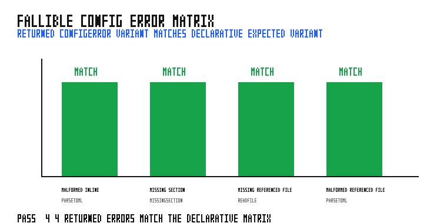

# fallible_config_matrix

This small program exercises the fallible configuration paths used by
programmatic Grass callers. Its declarative `config.toml` names the expected
`ConfigError` variant for malformed inline TOML, a missing required section,
a missing referenced sub-App file, and a malformed referenced sub-App file.
The latter two run through `MultiIoExt::try_add_subapp_with_config`, so the
builder is not invoked when configuration preparation fails.

## Run

```bash
cargo run --example fallible_config_matrix
python3 examples/fallible_config_matrix/sweep.py
```

## Validation



The graph shows the four returned `ConfigError` variants against the expected
declarative matrix. The committed result is PASS: all four operations returned
the expected typed error without printing or terminating the process.
