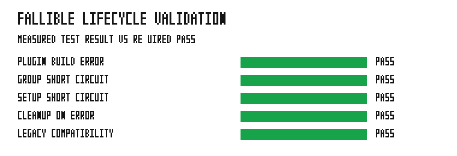

# Fallible lifecycle validation

This validation executes the `grass_app` fallible plugin-build and setup tests.
Each row is measured from the test command; the required value for every row is
PASS. It checks failure propagation through a plugin group, setup short-circuit,
cleanup, and the compatibility path for existing plugins and setup systems.



The recorded result is PASS.

## Run

```bash
../../automation/bin/run-bench.sh examples/fallible_lifecycle
```
