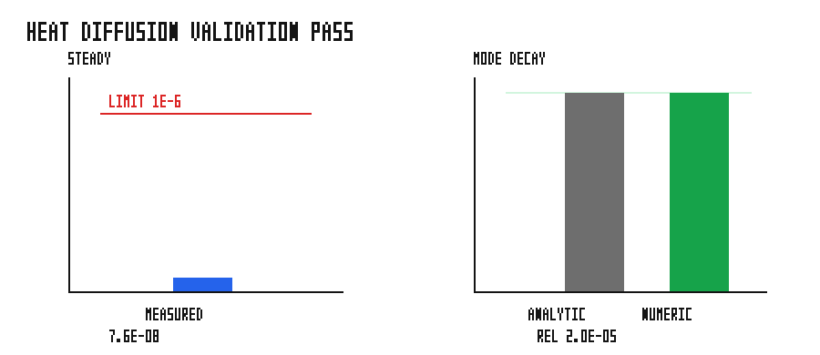

# heat_diffusion_1d

Structured-grid finite-difference 1-D heat diffusion on `grass_scheduler`. This
is the non-particle proof: the scheduler advances a field with no particles,
atoms, neighbor lists, positions, or pairwise interactions.

## Validation

The binary asserts two analytical checks:

| Check | Criterion |
| --- | --- |
| Fixed-end steady state | max error from the exact linear profile `< 1e-6` |
| Fourier-mode decay | numerical amplitude within `5e-3` relative error of `exp(-alpha k^2 t)` |



The figure shows measured vs. analytical values for both checks. The steady
state panel reports the asserted max error against the `1e-6` pass line; the
mode-decay panel overlays numerical and analytical amplitudes with the 0.5%
tolerance band. PASS.

## Run

```bash
cargo run --example heat_diffusion_1d
python3 examples/heat_diffusion_1d/sweep.py
```
