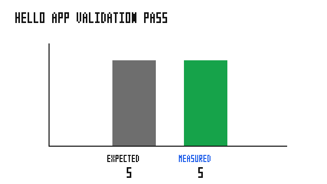

# hello_app

Smallest complete `grass_app` program: a plugin installs one counter resource,
one tick system, and one done-condition system. The app runs until the
done-condition stops it after five steps.

## Run

```bash
cargo run --example hello_app
```

Expected final line:

```text
hello_app: ran 5 steps
```

## Validation

The binary asserts that the done-condition stops the app at exactly five steps.



The figure shows the measured step count against the expected count. PASS.
