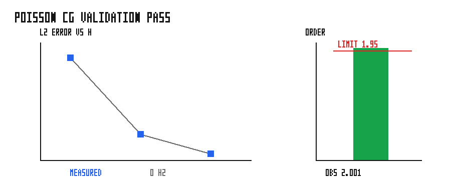

# matrix_free_poisson_cg

Matrix-free implicit Poisson solve hosted by `grass_scheduler`. The example keeps
the Poisson stencil and manufactured-solution data local to the example; the
core crate only provides the generic iterative-solver traits.

## Validation

The binary solves a manufactured-solution sweep on `15`, `31`, and `63` interior
points per side. It asserts that the L2 error decreases monotonically and that
the observed convergence order is greater than `1.95`.



The figure shows measured L2 error vs. grid spacing with a second-order reference
slope, plus the observed order against the `1.95` pass line. PASS.

## Run

```bash
cargo run --example matrix_free_poisson_cg
python3 examples/matrix_free_poisson_cg/sweep.py
```
