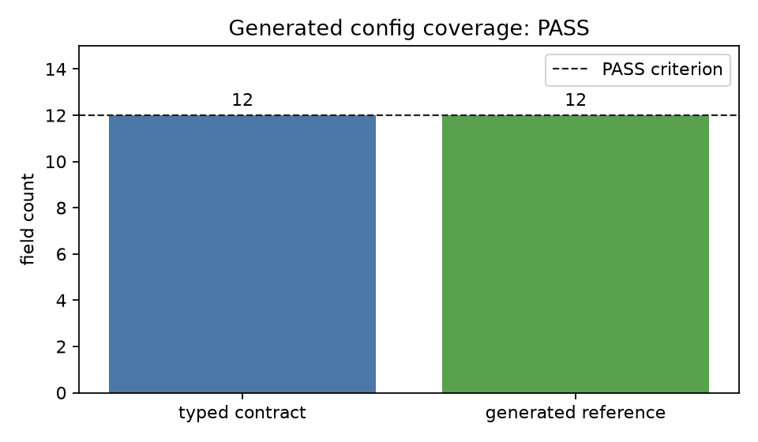

# observed_oscillator

End-to-end `grass_io` wiring for a simple harmonic oscillator observed through
the full I/O stack. The example reads its declarative [config.toml](config.toml),
runs two `[[run]]` stages, prints terminal columns, and writes JSON dump frames
under `examples/observed_oscillator/out/`.

## Run

```bash
cargo run --example observed_oscillator
```

Generate the typed starter configuration and field reference:

```bash
cargo run --example observed_oscillator -- --generate-config
```

Expected final line:

```text
observed_oscillator: finished at x = ..., v = ...
```

## Configuration-generation check



The check compares the 12 typed built-in fields expected by the oscillator's
plugins with the 12 fields emitted by `--generate-config` (PASS when both are
equal). It also verifies that every generated default deserializes back to the
same typed default.
