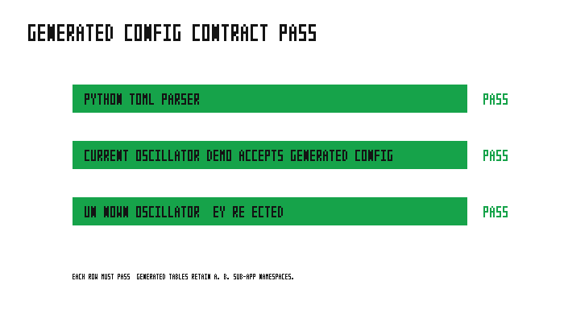

# oscillator_demo

This deliberately small library owns one harmonic oscillator's state,
semi-implicit-Euler integrator, plugin configuration, and typed position
payload. It does not own a peer or a coupling policy.

`main.rs` composes two unchanged instances in two ways. The direct experiment
uses typed `MultiRes` handles and therefore names both sub-app resources. The
port composition uses `PositionPort<A>` / `PositionPort<B>`: the application
owns the directional bindings while a consumer only receives the stable typed
position contract. Both use the same explicit, one-step-lag schedule and must
produce an identical final fingerprint.

Run it with:

```bash
cargo run --example oscillator_demo
python3 examples/oscillator_demo/sweep.py
```

Generate a complete namespaced starter file for the two current sub-apps:

```bash
cargo run --example oscillator_demo -- --generate-config
```

The validation test advances an uncoupled unit oscillator for `t=1` and
compares semi-implicit Euler against `x=cos(t), v=-sin(t)`. The maximum
component error is required to be below `1e-4`.


The committed figure shows the measured analytical error and the `1e-4` pass
criterion. Current result: PASS.



The second audit uses Python's independent TOML parser, then supplies the exact
generated file to the current `oscillator_demo` executable. It also injects an
unknown key and requires the `deny_unknown_fields` diagnostic. The generated
`[A.oscillator]` and `[B.oscillator]` tables are the same namespaces parsed by
the composed application.
