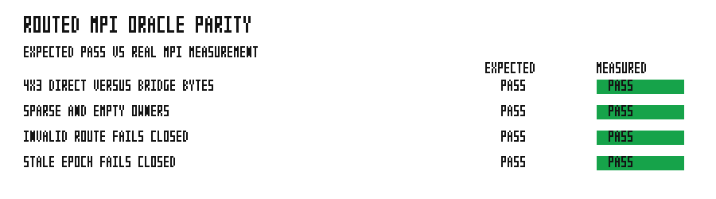

# Routed MPI oracle parity

This real-MPI campaign launches unequal 4-rank and 3-rank solver roles.  Over
five epochs it compares every direct sparse `RoutedRoleExchange` delivery
record, including its payload bytes, with an independent reconstruction of the
root-bridge delivery contract: peer-source rank order followed by each source's
original record order.  The routing matrix rotates silent sources, gives some
owners an empty delivery round, and checks global payload-count conservation.

The same campaign matrix also runs the existing real-MPI sparse-owner case and
two fail-closed cases.  The invalid-route and stale-epoch injections require
every rank to abort its round without deadlock; they run under a timeout in the
test harness.



The committed measurement is PASS: all four required real-MPI checks passed.
Each row is a pass/fail gate, so a mismatch, payload loss, ordering regression,
or failure to coordinate an invalid round renders that row FAIL.

## Run

```bash
../../automation/bin/run-bench.sh grass:examples/routed_mpi_oracle_parity
```
