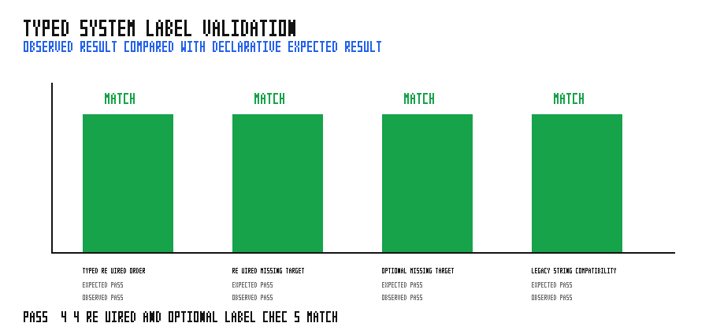

# typed_system_labels

This runnable scheduler matrix checks the typed `SystemLabel`/`SystemKey` API
alongside its migration behavior. It registers a typed key as a stable `const`,
uses `.requires(...)` to enforce and order a dependency, verifies the missing
target diagnostic names the key and suggests optional `.after(...)`, confirms
that optional ordering does not fail when the target is absent, and retains a
legacy string-label case.

## Run

```bash
cargo run --example typed_system_labels
python3 examples/typed_system_labels/sweep.py
```

## Validation



The graph compares each observed result with the declarative expected result.
The committed result is PASS: typed required ordering runs `integrate` before
`process`; a missing typed required target produces the actionable validation
diagnostic; optional ordering remains valid when absent; and legacy strings
continue to order systems.
