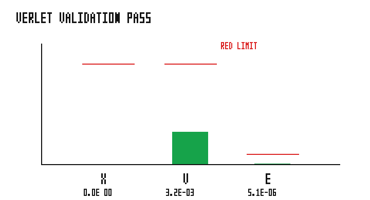

# verlet_minisolver

Velocity-Verlet mini-solver on `grass_scheduler`: a 1-D unit-mass spring advances
through ordered scheduler phases `KickA -> Drift -> KickB`.

## Validation

The binary runs one oscillator period and asserts:

| Check | Criterion |
| --- | --- |
| Position return | `|x - x0| < 1e-2` |
| Velocity return | `|v| < 1e-2` |
| Energy conservation | `|E - E0| < 1e-3` |



The figure shows each measured error against its asserted pass limit. PASS.

## Run

```bash
cargo run --example verlet_minisolver
python3 examples/verlet_minisolver/sweep.py
```
